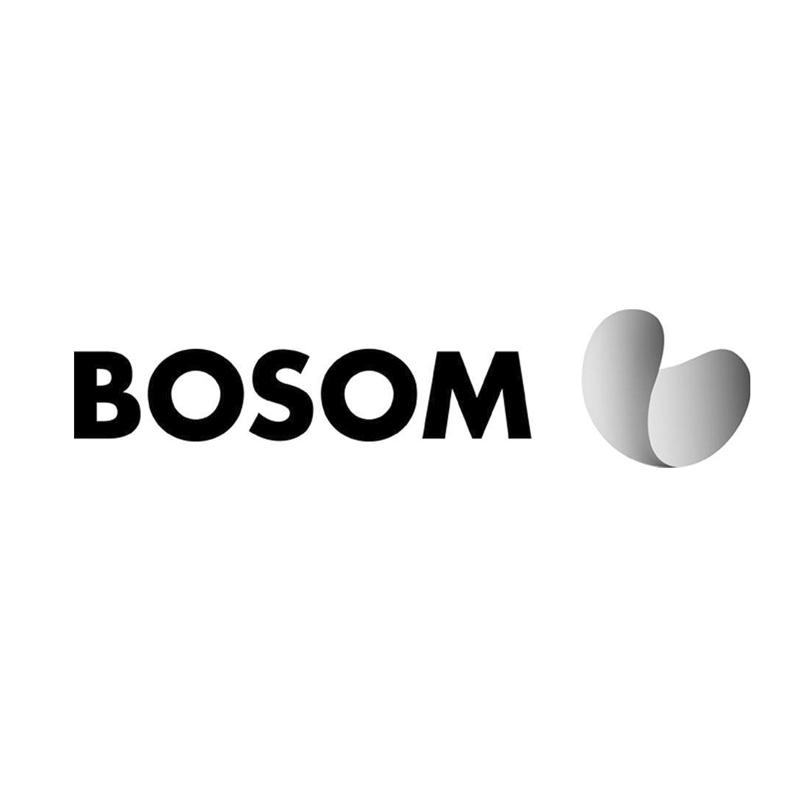

  <h1>BosomLang 1.20</h1>

### A mod that localizes hardcoded info, supports Forge and Fabric

| Version | Support | Stability |
|---------|---------|-----------|
| 1.20    | Full    | Stable    |

Notice
------
* [ ] This is a common i18n implementation between Banner and Mohist
* [ ] It still only using on Banner and Mohist at now.

A Special Thanks To:
-------------

[YourKit](http://www.yourkit.com/), makers of the outstanding java profiler, support open source projects of all kinds with their full-featured [Java](https://www.yourkit.com/java/profiler/index.jsp) and [.NET](https://www.yourkit.com/.net/profiler/index.jsp) application profilers. We thank them for granting Mohist an OSS license so that we can make our software the best it can be.
